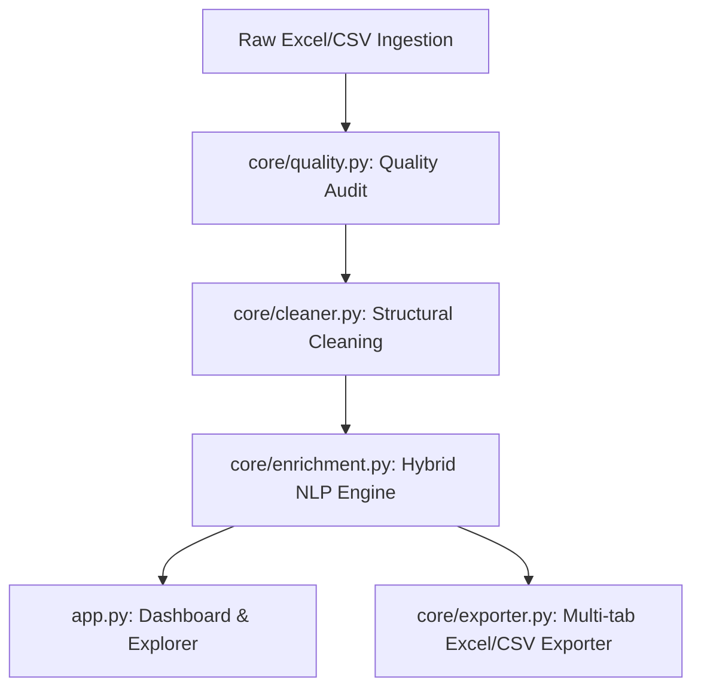

# Senior Interview Guide & Architectural Overview

This document provides a technical walkthrough of the **Customer Feedback Intelligence System** to prepare for a final-round assessment presentation. It outlines the architectural patterns, data engineering design decisions, trade-offs, and potential interviewer questions with answers.

---

## 🏛️ System Architecture Overview

The system follows a clean, modular, data-processing pipeline architecture:

### Module Breakdown
1. **`app.py` (Presentation & Orchestration)**: The Streamlit application that handles layout, sidebar uploads, navigation, and reactive updates for Plotly charts.
2. **`core/quality.py` (Data Profiler)**: Analyzes raw, dirty data and flags completeness issues without modifying data.
3. **`core/cleaner.py` (Data Sanitizer)**: Standardizes dates and cleans text. Applies flags to keep columns audit-ready.
4. **`core/enrichment.py` (Semantic Intelligence)**: Runs VADER sentiment analysis, category scoring, sarcasm detection, and template-based summarization.
5. **`core/exporter.py` (Asset Generation)**: Formats spreadsheet exports dynamically.

---

## 🛠️ Key Design Decisions & Trade-offs

### 1. NLP Model Choice: Heuristic & VADER vs. LLM/Transformers
* **Decision**: We opted for **NLTK VADER + Custom Regex Rules** over heavy pre-trained models (like `BART` or `DeBERTa`) or external API keys (like OpenAi GPT-4).
* **Rationale**: 
  * **Memory Limit**: Cloud platforms (like Streamlit Community Cloud) have a strict 1GB RAM ceiling. Loading deep learning models (>1.5GB) would result in instant Out-of-Memory (OOM) crashes.
  * **Latency**: VADER executes in milliseconds on CPU, enabling immediate processing of 1,810 records.
  * **Explainability**: Rule-based categorizers allow business analysts to adjust keywords easily.
* **Trade-off**: Lower semantic generalization compared to LLMs. For instance, misspellings of keywords might miss a category. We offset this by including multiple synonyms in the keyword pool.

### 2. Rating Preservation vs. Rating Imputation
* **Decision**: Kept missing ratings as `NULL/NaN` and flagged them with `rating_missing = True/False`.
* **Rationale**: In data warehousing, imputing a rating based on text introduces bias into customer rating trends. If a customer chose *not* to leave a rating, it is critical for product managers to know this rather than skewing the NPS or CSAT calculations with imputed values.

### 3. Exact vs. Fuzzy Deduplication
* **Decision**: Only removed exact duplicate rows. Retained rows where the text was identical but other fields differed (flagging them with `duplicate_feedback_flag = True`).
* **Rationale**: If two customers leave the review *"Food was cold"* at different times, both complaints are valid operational issues. Deleting one would lead to underreporting delivery issues.

---

## 💬 Anticipated Interview Q&A

### Q1: How does your sarcasm detector work? Why not use a transformer model?
* **Answer**: "We built a multi-stage sarcasm detection engine. First, it uses regex patterns to capture explicit sarcasm (e.g. *'Oh great, crashed again'*). Second, it checks for rating-sentiment contradictions: if the rating is 1 or 2, but the text contains highly positive words (e.g. *'wonderful'*, *'excellent'*, *'brilliant'*) without negations, we flag it as sarcastic.
  A transformer model would generalize better but introduces deployment challenges: high latency, massive memory footprints, and high compute cost. Our rule-based approach runs instantly on free tier environments with zero cost, and is easily customizable."

### Q2: How did you handle inconsistent timestamps?
* **Answer**: "We utilized `pd.to_datetime` with format inferencing in a custom mapping loop. It handles standard ISO formats, Unix Epoch times (seconds and milliseconds), and slash formats (e.g. `DD/MM/YYYY`). Any date that fails parsing is set to `NaT` and flagged as `timestamp_missing`, preventing pipeline crashes."

### Q3: Why did you choose Streamlit and Plotly for the frontend instead of React/Flask or Power BI?
* **Answer**: "Streamlit allows fast, Python-native prototype development. Plotly provides fully interactive charts (zoom, filter, hover) that run directly in the browser. Using Power BI would require an external platform integration, which complicates deployment. This stack is self-contained and deployable on a single free-tier cloud container."

### Q4: How is this system ready to scale for larger datasets (e.g., 100k+ rows)?
* **Answer**: "Because all cleaning and profiling steps are vectorized using Pandas and NumPy, processing scales linearly. NLTK VADER handles sentiment token-by-token and can be parallelized using Python's `multiprocessing` package if needed. For enterprise scale, we would shift the data processing pipeline into Snowflake or PySpark, while keeping the Streamlit dashboard as a lightweight visualization layer."
